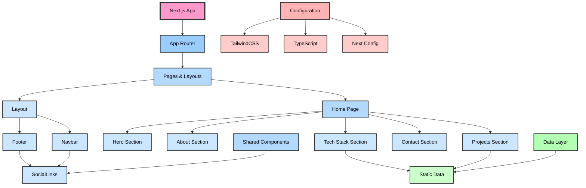

```mermaid
graph TD
    %% Main Application Structure
    A[Next.js App] --> B[App Router]
    B --> C[Pages & Layouts]

    %% Core Components
    C --> D[Layout]
    D --> E[Navbar]
    D --> F[Footer]

    %% Main Page Components
    C --> G[Home Page]
    G --> H[Hero Section]
    G --> I[About Section]
    G --> J[Projects Section]
    G --> K[Tech Stack Section]
    G --> L[Contact Section]

    %% Shared Components
    M[Shared Components] --> N[SocialLinks]
    E --> N
    F --> N

    %% Styling and Configuration
    O[Configuration] --> P[TailwindCSS]
    O --> Q[TypeScript]
    O --> R[Next Config]

    %% Data Layer
    S[Data Layer] --> T[Static Data]
    J --> T
    K --> T

    %% Styling with better contrast
    style A fill:#ff99cc,stroke:#333,stroke-width:4px,color:#000000
    style B fill:#99ccff,stroke:#333,stroke-width:2px,color:#000000
    style C fill:#b3d9ff,stroke:#333,stroke-width:2px,color:#000000
    style D fill:#cce6ff,stroke:#333,stroke-width:2px,color:#000000
    style E fill:#cce6ff,stroke:#333,stroke-width:2px,color:#000000
    style F fill:#cce6ff,stroke:#333,stroke-width:2px,color:#000000
    style G fill:#b3d9ff,stroke:#333,stroke-width:2px,color:#000000
    style H fill:#cce6ff,stroke:#333,stroke-width:2px,color:#000000
    style I fill:#cce6ff,stroke:#333,stroke-width:2px,color:#000000
    style J fill:#cce6ff,stroke:#333,stroke-width:2px,color:#000000
    style K fill:#cce6ff,stroke:#333,stroke-width:2px,color:#000000
    style L fill:#cce6ff,stroke:#333,stroke-width:2px,color:#000000
    style M fill:#b3d9ff,stroke:#333,stroke-width:2px,color:#000000
    style N fill:#cce6ff,stroke:#333,stroke-width:2px,color:#000000
    style O fill:#ffb3b3,stroke:#333,stroke-width:2px,color:#000000
    style P fill:#ffcccc,stroke:#333,stroke-width:2px,color:#000000
    style Q fill:#ffcccc,stroke:#333,stroke-width:2px,color:#000000
    style R fill:#ffcccc,stroke:#333,stroke-width:2px,color:#000000
    style S fill:#b3ffb3,stroke:#333,stroke-width:2px,color:#000000
    style T fill:#ccffcc,stroke:#333,stroke-width:2px,color:#000000
```
